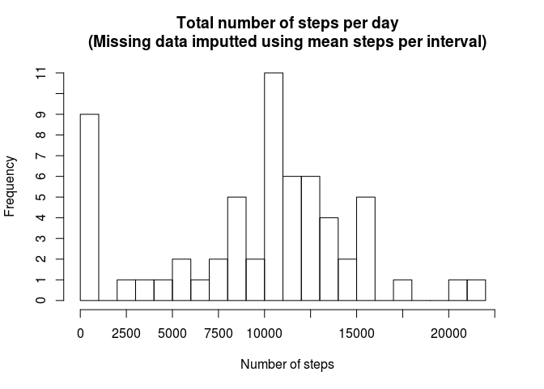

## Loading and preprocessing the data

It is assumed that the data exists in the working directory. 


```r
require(dplyr)
```

```
## Loading required package: dplyr
```

```
## 
## Attaching package: 'dplyr'
```

```
## The following objects are masked from 'package:stats':
## 
##     filter, lag
```

```
## The following objects are masked from 'package:base':
## 
##     intersect, setdiff, setequal, union
```

```r
require(ggplot2)
```

```
## Loading required package: ggplot2
```

```r
steps <- read.csv("activity.csv")
```

## What is mean total number of steps taken per day?

1. Calculate the total number of steps taken per day.


```r
steps.per.day <- steps %>%
    select(date, steps) %>%
    group_by(date) %>%
    summarise(steps = sum(steps, na.rm = TRUE))
```

2. Histogram of the total number of steps taken per day.


```r
with(steps.per.day, {
    hist(steps, breaks = 20, main = "Total number of steps per day", xlab = "Number of steps", xlim = c(0, 22500),
         axes = F)
    axis(side = 1, at = c(seq(from=0, to=22500, by=2500)))
    axis(side = 2, at = c(seq(from=0, to=11, by=1)))
})
```

<!-- -->

3. Mean and median of the total number of steps taken per day.


```r
with(steps.per.day, {
    print(paste("Mean steps per day   = ", round(mean(steps), 0)))
    print(paste("Median steps per day = ", median(steps)))
})
```

```
## [1] "Mean steps per day   =  9354"
## [1] "Median steps per day =  10395"
```

## What is the average daily activity pattern?

1. Time series plot of the 5-minute interval and the average number of steps taken, averaged across all days.


```r
steps.per.interval <- steps %>%
    select(interval, steps)  %>%
    group_by(interval) %>%
    summarise(mean.steps = mean(steps, na.rm = TRUE),
              median.steps = median(steps, na.rm = TRUE)
              )

ggplot(steps.per.interval) +
   geom_line(aes(interval, mean.steps, color = "Mean")) + 
   geom_line(aes(interval, median.steps, color = "Median" )) +
   scale_color_discrete(name = "Average") +
   labs(x = "Interval", y = "Number of steps")
```

<!-- -->

2. 5-minute interval, on average across all the days in the dataset, which contains the maximum number of steps.


```r
maxInternval <- as.integer(steps.per.interval[steps.per.interval$mean.steps == max(steps.per.interval$mean.steps),"interval"])
print(paste("The 5-minute internval with the maximum number of steps is", 
            sprintf('%0.2d:%0.2d', floor(maxInternval / 100), maxInternval %% 100)))
```

```
## [1] "The 5-minute internval with the maximum number of steps is 08:35"
```

## Imputing missing values

1. Total number of missing values in the dataset.


```r
steps.na <- is.na(steps$steps)
print(paste("The number of missing values in the dataset is", sum(steps.na)))
```

```
## [1] "The number of missing values in the dataset is 2304"
```

2 & 3. Creation of a new datset, based on the original dataset but with missing data filled in. The strategy for imputting missing values is to use the mean number of steps for the 5-minute interval across all the days.


```r
steps.imputted <- steps 

steps.imputted[steps.na == TRUE, "steps"] <- steps.per.interval[steps.per.interval$interval == steps[steps.na == TRUE, "interval"],"mean.steps"]
```

4. Histogram of the of the total number of steps taken per day including imputted data.


```r
steps.per.day.imputted <- steps.imputted %>%
    select(date, steps) %>%
    group_by(date) %>%
    summarise(steps = sum(steps, na.rm = TRUE))

with(steps.per.day.imputted, {
    hist(steps, breaks = 20, main = "Total number of steps per day\n(Missing data imputted using mean steps per interval)", 
         xlab = "Number of steps", xlim = c(0, 22500),
         axes = F)
    axis(side = 1, at = c(seq(from=0, to=22500, by=2500)))
    axis(side = 2, at = c(seq(from=0, to=11, by=1)))
})
```

<!-- -->
Mean and median of the total number of steps taken per day including imputted data.


```r
with(steps.per.day.imputted, {
    print(paste("Mean steps per day   = ", round(mean(steps), 0)))
    print(paste("Median steps per day = ", median(steps)))
})
```

```
## [1] "Mean steps per day   =  9531"
## [1] "Median steps per day =  10439"
```

The impact of imputing data on the mean and median of steps taken per day.


```r
print(paste0("Increase in mean when including imputted data is ",
    round((mean(steps.per.day.imputted$steps) / mean(steps.per.day$steps) - 1) * 100, 1), "%"))
```

```
## [1] "Increase in mean when including imputted data is 1.9%"
```

```r
print(paste0("Increase in median when including imputted data is ",
    round((median(steps.per.day.imputted$steps) / median(steps.per.day$steps) - 1) * 100, 1), "%"))
```

```
## [1] "Increase in median when including imputted data is 0.4%"
```

## Are there differences in activity patterns between weekdays and weekends?

1. Creation of a new factor variable in the dataset indicating whether the given date is a weekday or weekend day.


```r
steps <- steps %>%
    mutate(daytype = factor(ifelse(weekdays(as.POSIXlt(as.character(date))) %in% c("Saturday", "Sunday"), 
        "weekend", "weekday")))
```

2. Panel plot containing  time series plot of 5-minute interval and the average numberof steps taken, averaged across all weekday or weekend days.


```r
steps.per.interval.by.daytype <- steps %>%
    select(interval, daytype, steps)  %>%
    group_by(interval, daytype) %>%
    summarise(mean.steps = mean(steps, na.rm = TRUE),
              median.steps = median(steps, na.rm = TRUE)
    )

ggplot(steps.per.interval.by.daytype) +
    facet_wrap(~ daytype, ncol = 1) + 
    geom_line(aes(interval, mean.steps, color = "Mean")) + 
    geom_line(aes(interval, median.steps, color = "Median" )) +
    scale_color_discrete(name = "Average") + 
    labs(x = "Interval", y = "Number of steps")
```

<!-- -->
